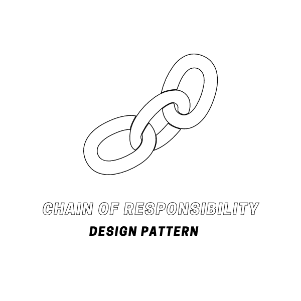
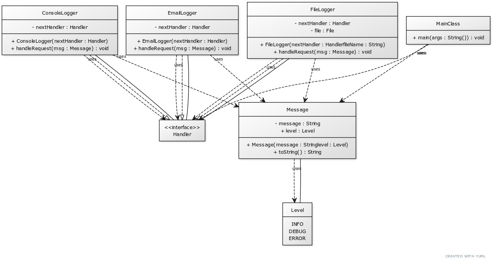

# Chain of Responsibility Design Pattern

The Chain of Responsibility Design Pattern is a behavioral design pattern that allows an object to pass the request along the chain of potential handlers until an object handles it. It involves a series of classes that are responsible for different types of requests. Each class in the chain has a reference to the next class in the chain. If one object cannot handle the request, it passes it to the next object in the chain.

    </img>

## ☹️ Problem

Imagine you're developing a logging system. The system needs to be able to log different levels of messages like Debug, Info, Error, etc. Each level of message might be handled differently (e.g., written to a log file, displayed on the console, sent by email). How can you design the system so that each message is handled appropriately, and adding new types of messages or handlers is easy?

## 😀 Solution

The Chain of Responsibility Design Pattern provides a solution to this problem. You can create a `Handler` interface that declares a method for handling requests. Concrete handlers implement this interface and define their own way of handling requests. Each handler has a reference to the next handler in the chain. When a handler receives a request, it either handles it or passes it to the next handler in the chain.

For example, you can have a `ConsoleLogger` handler for Debug messages, a `FileLogger` handler for Info messages, and an `EmailLogger` handler for Error messages. When a message comes in, it's passed along the chain until it reaches a handler that can handle messages of that level. This way, each message is handled appropriately, and you can easily add new types of messages or handlers by extending the chain. In the context of our logging system:

1. **Handler Interface**: This is an interface that declares a method for handling requests. The concrete handler classes will implement this interface.
2. **Concrete Handlers (`ConsoleLogger`, `FileLogger`, `EmailLogger`)**: These are concrete classes that implement the `Handler` interface and provide specific implementations for handling requests. For example, the `ConsoleLogger` class provides its own implementation of the `handle()` method.
3. **Request (`Message`)**: This class represents the request that needs to be handled. It contains information about the request, such as the message level.
4. **Client (`MainClass`)**: This class uses the context object to interact with the chain of responsibility. It calls the `handle()` method on the context object to handle requests.

This way, you can define a series of handlers that are responsible for different types of requests and pass the request along the chain until it's handled. For example, you can create a `LoggerContext` object and use it to handle different types of messages. You can find the implementation of this example in the [code snippet](./src). Below is the UML class diagram of the Chain of Responsibility design pattern.

    </img>

## 💡 Applicability

Use the Chain of Responsibility pattern when:

1. You want to decouple the sender and receiver of a request based on the type of request.
2. You have multiple objects that can handle a request, and the handler should be determined dynamically at runtime.
3. You want to allow multiple objects to handle a request without specifying the handler explicitly.
4. You want to avoid hard-coding the receiver of a request and allow the system to determine it dynamically.
5. You want to pass a request along a chain of potential handlers until one of them handles it.

## 📝 How to Implement

To implement the Chain of Responsibility Design Pattern, you can follow these steps:

1. Identify the different types of requests that the system needs to handle.
2. Create a `Handler` interface that declares a method for handling requests.
3. Create concrete handler classes that implement the `Handler` interface and provide specific implementations for handling requests.
4. Each concrete handler class should have a reference to the next handler in the chain.
5. Create a chain of responsibility that holds references to all the concrete handler objects and passes the request along the chain until it's handled.
6. The client code should use the chain of responsibility to handle requests. It should call the `handle()` method on the chain to start the request handling process.
7. When a request comes in, the chain of responsibility should pass the request along the chain until it's handled by a concrete handler.
8. If a handler cannot handle the request, it should pass the request to the next handler in the chain.
9. The client code should interact with the chain of responsibility to handle requests and receive responses.

## ⚖️ Pros and Cons

### Pros

- Decouples the sender and receiver of a request based on the type of request.
- Allows multiple objects to handle a request without specifying the handler explicitly.
- Dynamically determines the handler at runtime based on the type of request.
- Avoids hard-coding the receiver of a request and allows the system to determine it dynamically.
- Passes a request along a chain of potential handlers until one of them handles it.

### Cons

- Can be challenging to debug and trace the path of a request through the chain of responsibility.
- May lead to performance issues if the chain is too long or if there are too many handlers in the chain.
- Requires careful design to ensure that each handler in the chain handles the request appropriately.
- Can be complex to implement if the chain of responsibility is not well-designed or if the handlers are not properly linked.
- May introduce additional overhead due to the delegation of request handling to multiple handlers.
