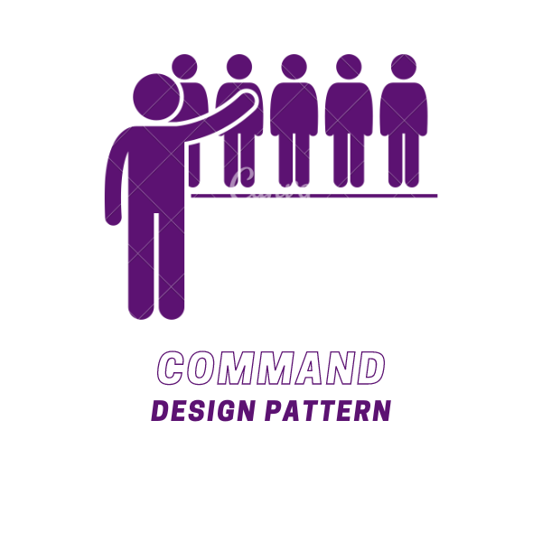
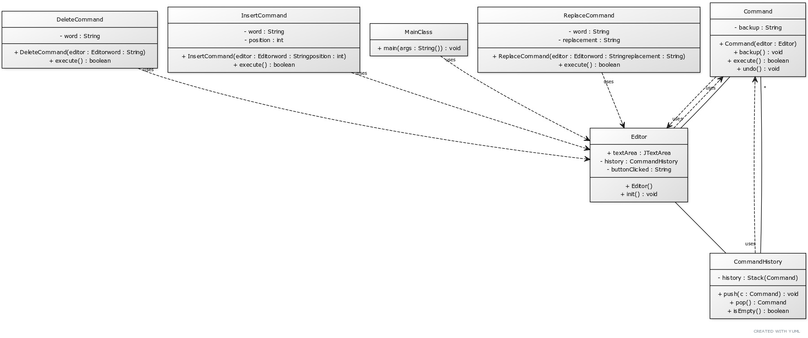

# Command Design Pattern

The Command Design Pattern is a behavioral design pattern that encapsulates a request as an object, thereby letting you parameterize clients with queues, requests, or operations. It allows you to decouple the sender and receiver of a request based on the type of request. This pattern involves a series of classes that are responsible for different types of requests. Each class in the chain has a reference to the next class in the chain. If one object cannot handle the request, it passes it to the next object in the chain.

    </img>

## ☹️ Problem

Imagine you're developing a text editor. The editor needs to provide multi-level undo/redo functionality. Each operation performed on the text (like insert, delete, replace) can be undone or redone. How can you implement this in a way that allows adding new types of operations easily and ensures that the undo/redo operations always result in a consistent state of the document?

## 😀 Solution

The Command Design Pattern provides a solution to this problem. You can create a `Command` interface that declares methods for executing an operation and undoing it. Each operation is implemented as a separate `Command` class such as `InsertCommand`, `DeleteCommand`, `ReplaceCommand`, etc. Each `Command` class knows how to execute its operation and undo it. The text editor has an `Editor` class that keeps track of the document state and executes commands. When an operation is performed, a command object representing the operation is created and executed, and then added to the history. When the user undoes an operation, the editor takes the most recent command from the history and calls its undo method. For redo, the editor can keep a separate stack of undone commands, and re-execute them when the user performs a redo operation. This way, each operation can be easily undone or redone, and you can add new types of operations by creating new `Command` classes. The state of the document remains consistent, as each `Command` knows exactly how to undo its operation. In the context of our text editor:

1. **Command Interface**: This is an interface that declares methods for executing an operation and undoing it. The concrete command classes will implement this interface.
2. **Concrete Commands (`InsertCommand`, `DeleteCommand`, `ReplaceCommand`)**: These are concrete classes that implement the `Command` interface and provide specific implementations for executing and undoing operations. For example, the `InsertCommand` class provides its own implementation of the `execute()` and `undo()` methods.
3. **Receiver (`Editor`)**: This class keeps track of the document state and executes commands. It creates command objects representing operations and executes them. It also keeps track of the command history and undone commands.
4. **Client (`MainClass`)**: This class uses the receiver object to interact with the command objects. It creates command objects and executes them to perform operations on the document.

This way, you can define a series of commands that represent different types of operations and execute them to perform operations on the document. You can easily undo or redo operations by executing the undo or redo methods on the command objects. You can find the implementation of this example in the [code snippet](./src). Below is the UML class diagram of the Command Design Pattern.

    </img>

## 💡 Applicability

Use the Command pattern when:

1. You want to decouple the sender and receiver of a request based on the type of request.
2. You want to parameterize clients with queues, requests, or operations.
3. You want to allow clients to undo and redo operations.

## 📝 How to Implement

To implement the Command Design Pattern, you can follow these steps:

1. Identify the different types of operations that the system needs to perform.
2. Create a `Command` interface that declares methods for executing an operation and undoing it.
3. Create concrete command classes that implement the `Command` interface and provide specific implementations for executing and undoing operations.
4. Create a receiver class that keeps track of the document state and executes commands. It creates command objects representing operations and executes them.
5. The client code should use the receiver object to interact with the command objects. It should create command objects and execute them to perform operations on the document.

## ⚖️ Pros and Cons

### Pros

- Decouples the sender and receiver of a request based on the type of request.
- Allows you to parameterize clients with queues, requests, or operations.
- Enables clients to undo and redo operations.
- Makes it easy to add new types of operations by creating new command classes.

### Cons

- Can introduce a large number of command classes if there are many types of operations.
- Can make the system more complex by introducing additional layers of abstraction.
- Can be less efficient if there are many small operations that need to be executed.
- Can be harder to debug and maintain if the command objects are not implemented correctly.
