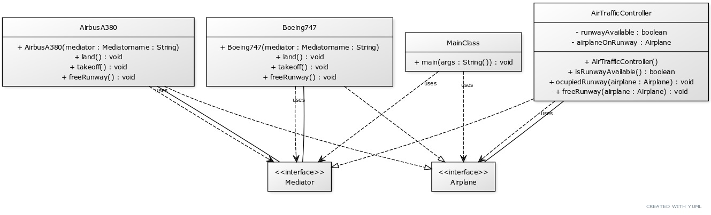

# Mediator Design Pattern

The Mediator Design Pattern is a behavioral design pattern that reduces coupling between components of a program by making them communicate indirectly, through a special mediator object. The Mediator becomes the center of communication: components either communicate with the Mediator or through it. This pattern is useful when you have a complex system with many components that need to communicate with each other, but you want to avoid tight coupling between them.

    </img>

## ☹️ Problem

Imagine you're developing a system to simulate air traffic control. The system includes various airplanes that need to take off, land, and navigate around the airport. If the airplanes communicate directly with each other to coordinate their actions, it could lead to a lot of complexity and potential miscommunications. How can you design the system so that the airplanes can coordinate their actions without knowing about each other?

## 😀 Solution

The Mediator Design Pattern provides a solution to this problem. You can create an `AirTrafficControl` class that acts as a mediator between the different object of `Airplane` class. The airplanes communicate with the `AirTrafficControl` when they want to take off, land, or move around the airport. For example, when an object of `Airplane` class wants to take off, it sends a request to the `AirTrafficControl`. The `AirTrafficControl` checks if the runway is clear and then sends a response to the airplane, allowing it to take off. Similarly, when an airplane wants to land, it sends a request to the `AirTrafficControl`, which checks if the runway is clear and then sends a response to the airplane, allowing it to land. This way, the `Airplane` are decoupled from each other, and the `AirTrafficControl` can ensure that the airplanes coordinate their actions safely and efficiently. In the context of our air traffic control system:

1. **Mediator (`AirTrafficControl`)**: This class acts as a mediator between the different objects of `Airplane` class. It provides methods for the airplanes to communicate with each other indirectly.
2. **Colleague (`Airplane`)**: This class represents the airplanes in the system. It communicates with the mediator (`AirTrafficControl`) when it wants to take off, land, or move around the airport.
3. **Client (`MainClass`)**: This class uses the mediator object to interact with the airplane objects. It creates airplane objects and sends requests to the mediator to coordinate their actions.
4. **Concrete Colleagues (`Boeing747`, `AirbusA380`)**: These are concrete classes that represent different types of airplanes. They communicate with the mediator (`AirTrafficControl`) to coordinate their actions.

This way, you can design a system where the airplanes communicate with each other indirectly through a mediator object. The mediator ensures that the airplanes coordinate their actions safely and efficiently. You can find the implementation of this example in the [code snippet](./src). Below is the UML class diagram of the Mediator Design Pattern.

    </img>

## 💡 Applicability

Use the Mediator pattern when:

1. You want to reduce coupling between components of a program.
2. You want to centralize control of communication between components.
3. You want to make it easier to add new components to the system.
4. You want to make it easier to understand how components interact with each other.
5. You want to make it easier to re-use components in different contexts.

## 📝 How to Implement

To implement the Mediator Design Pattern, you can follow these steps:

1. Identify the different components of the system that need to communicate with each other.
2. Create a Mediator interface that declares methods for components to communicate with each other.
3. Create a concrete Mediator class that implements the Mediator interface and provides specific implementations for communication between components.
4. Create Colleague classes that represent the different components of the system. These classes should communicate with the Mediator when they need to interact with other components.
5. The client code should use the Mediator object to interact with the Colleague objects. It should create Colleague objects and send requests to the Mediator to coordinate their actions.
6. You can add new components to the system by creating new Colleague classes and updating the Mediator to handle communication with the new components.

## ⚖️ Pros and Cons

### Pros

- Reduces coupling between components of a program.
- Centralizes control of communication between components.
- Makes it easier to add new components to the system.
- Makes it easier to understand how components interact with each other.
- Makes it easier to re-use components in different contexts.

### Cons

- Can make the system more complex by introducing an additional layer of abstraction.
- Can make it harder to debug and maintain the system if the mediator object is not implemented correctly.
- Can reduce the performance of the system if the mediator object becomes a bottleneck for communication between components.
- Can make it harder to understand the flow of communication between components if the mediator object is too complex.
