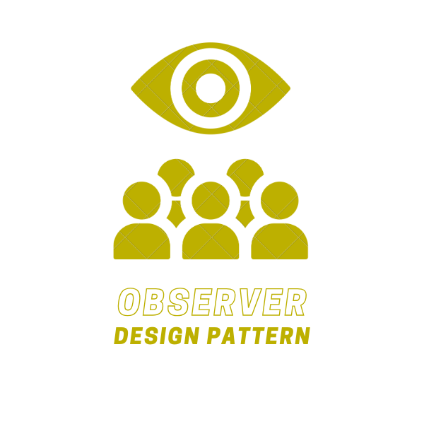
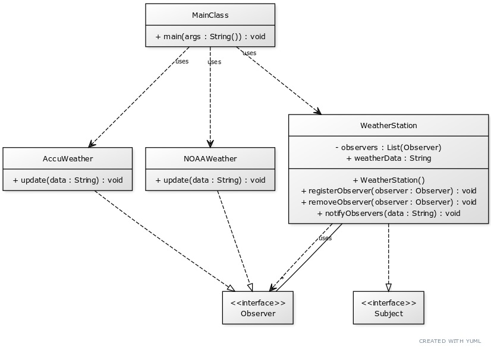

# Observer Design Pattern

The Observer Design Pattern is a behavioral design pattern that allows an object (known as the subject) to notify other objects (known as observers) about changes in its state. The subject maintains a list of observers and notifies them by calling their methods when its state changes. This pattern is useful when the state of one object should automatically affect the state of other objects, without making the objects tightly coupled.

    </img>

## ☹️ Problem

Imagine you're developing a weather monitoring system. The system includes a weather station that measures temperature, humidity, and pressure. You have multiple display elements that need to show the current measurements. If the display elements fetch the data directly from the weather station, it could lead to a lot of complexity and potential inconsistencies. How can you design the system so that the display elements can automatically update their display when the measurements change, without knowing about each other?

## 😀 Solution

The Observer Design Pattern provides a solution to this problem. You can create a `WeatherStation` class that acts as the subject. The `WeatherStation` maintains a list of observers (the display elements) and notifies them when its measurements change. For example, when the `WeatherStation` measures a new temperature, it notifies all the observers, which then update their display. This way, the display elements are decoupled from each other, and the `WeatherStation` can ensure that they are updated automatically and consistently. In the context of our weather monitoring system:

1. **Subject (`WeatherStation`)**: This class acts as the subject. It maintains a list of observers and notifies them when its measurements change.
2. **Observer (`DisplayElement`)**: This class represents the display elements in the system. It updates its display when it is notified by the subject (`WeatherStation`).
3. **Client (`MainClass`)**: This class uses the subject and observer objects to create a weather monitoring system. It creates a `WeatherStation` object and `DisplayElement` objects, and registers the `DisplayElement` objects as observers of the `WeatherStation`.

This way, you can design a system where the subject notifies the observers about changes in its state. The observers update their display automatically and consistently. You can find the implementation of this example in the [code snippet](./src). Below is the UML class diagram of the Observer Design Pattern.

    </img>

## 💡 Applicability

Use the Observer pattern when:

1. You want to notify multiple objects about changes in the state of another object.
2. You want to decouple the subject from its observers.
3. You want to allow multiple observers to subscribe to changes in the subject.
4. You want to avoid tight coupling between the subject and its observers.
5. You want to make it easier to add new observers to the system.

## 📝 How to Implement

To implement the Observer Design Pattern, you can follow these steps:

1. Identify the subject and observer classes in the system.
2. Create an Observer interface that declares a method for the subject to notify the observers.
3. Create a concrete Observer class that implements the Observer interface and provides specific implementations for updating the observer's state.
4. Create a Subject class that maintains a list of observers and provides methods for the observers to subscribe and unsubscribe.
5. The Subject class should notify the observers by calling their update method when its state changes.
6. The client code should use the Subject and Observer objects to create a system where the subject notifies the observers about changes in its state.

## ⚖️ Pros and Cons

### Pros

- Allows an object to notify multiple objects about changes in its state.
- Decouples the subject from its observers.
- Allows multiple observers to subscribe to changes in the subject.
- Avoids tight coupling between the subject and its observers.
- Makes it easier to add new observers to the system.

### Cons

- Observers may receive notifications about changes they are not interested in.
- The subject may send notifications to observers that are no longer interested in receiving them.
- The subject may send notifications to observers in a specific order, which may affect the behavior of the system.
- The subject may send notifications to observers that are not in a valid state to receive them.
