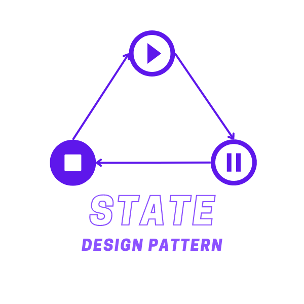
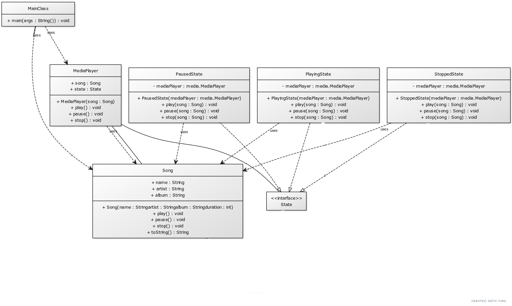

# State Design Pattern

The State Design Pattern is a behavioral design pattern that allows an object to change its behavior when its internal state changes. The object will appear to change its class. This pattern is used to define a set of states that an object can be in and allow the object to change its state at runtime. It is closely related to the concept of finite-state machines.

    </img>

## ☹️ Problem

Imagine you're developing a media player application. The player has different states (Playing, Paused, Stopped), and the behavior of the player changes depending on its current state. How can you implement this in a way that allows adding new states easily without changing existing state classes?

## 😀 Solution

The State Design Pattern provides a solution to this problem. You can create an abstract `State` base class that declares a method for each action, and concrete state classes that implement these methods. The context class (Media Player) holds a reference to a state object that represents its current state, and delegates all state-related behavior to this object. When the state changes, the context object changes the state object to a different one. In the context of our media player application:

1. **Abstract Class (`State`)**: This is an abstract class that declares methods for each action that the media player can perform. For example, `play()`, `pause()`, `stop()`. The concrete state classes will implement these methods.
2. **Concrete Classes (`PlayingState`, `PausedState`, `StoppedState`)**: These are concrete classes that extend the `State` class and provide specific implementations for the actions. For example, the `PlayingState` class provides its own implementation of `play()`, `pause()`, and `stop()`.
3. **Context (`MediaPlayer`)**: This class holds a reference to a state object that represents the current state of the media player. It delegates all state-related behavior to this object. When the state changes, the context object changes the state object to a different one.
4. **Client (`MainClass`)**: This class uses the context object to interact with the media player. It calls the methods on the context object to perform actions like play, pause, stop.

This way, you can define a set of states that the media player can be in and allow the media player to change its state at runtime. For example, you can create a `MediaPlayer` object and use it to play, pause, and stop media. You can find the implementation of this example in the [code snippet](./src). Below is the UML class diagram of the State design pattern.

    </img>

## 💡 Applicability

Use the State pattern when:

1. An object's behavior depends on its state, and it must change its behavior at runtime depending on that state.
2. Operations have large, multipart conditional statements that depend on the object's state.
3. You have multiple states that share some behavior, but differ in the implementation of other behaviors.
4. You want to avoid using switch-case statements to determine the behavior of an object based on its state.
5. You want to define a set of states that an object can be in and allow the object to change its state at runtime.
6. You want to define state-specific behavior in separate classes and avoid mixing it with the context class.

## 📝 How to Implement

To implement the State Design Pattern, you can follow these steps:

1. Identify the states that an object can be in and define them as classes that implement a common interface or extend a common base class.
2. Create an interface or abstract class that declares methods for each action that the object can perform.
3. Create concrete state classes that implement the interface or extend the abstract class and provide specific implementations for the actions.
4. Create a context class that holds a reference to a state object and delegates all state-related behavior to this object.
5. The context class should have methods to set and get the state object, and methods to perform actions that delegate to the state object.
6. The client code should use the context object to interact with the object. It should call the methods on the context object to perform actions.
7. The context object should delegate the actions to the state object, which will perform the action based on the current state.
8. When the state changes, the context object should change the state object to a different one.
9. The state objects should be responsible for changing the state of the context object.

## ⚖️ Pros and Cons

### Pros

- Encapsulates state-specific behavior in separate classes and allows the object to change its behavior at runtime.
- Simplifies code by removing large, multipart conditional statements that depend on the object's state.
- Improves code readability and maintainability by separating state-specific behavior from the context class.
- Allows adding new states without changing existing state classes or the context class.
- Promotes the Open/Closed Principle by allowing new states to be added without modifying existing code.

### Cons

- Can lead to a large number of classes if there are many states and actions.
- Can be complex to implement if the states have complex interactions or transitions.
- May introduce additional overhead due to the delegation of state-specific behavior to state objects.
- Can be difficult to debug if the state transitions are not well-defined or if the context object is not properly synchronized with the state object.
- May require additional error handling to handle invalid state transitions or unexpected state changes.
