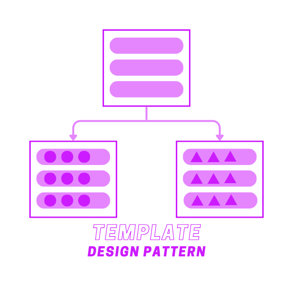
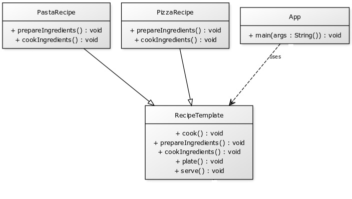

# Template Method Design Pattern

The Template Method Design Pattern is a behavioral design pattern that defines the program skeleton of an algorithm in a method, called the template method, which defers some steps to subclasses. It lets subclasses redefine certain steps of an algorithm without changing the algorithm's structure.

    </img>

## ☹️ Problem

Imagine you're developing a cooking application. The application needs to guide the user through various recipes. While each recipe is different, they all follow a similar process: prepare ingredients, cook ingredients, serve. The details of each step can vary depending on the specific recipe. How can you ensure that the structure of the cooking process stays the same, while allowing different recipes to provide different implementations for each step?

## 😀 Solution

The Template Method Design Pattern provides an elegant solution to this problem. You can create an abstract `Recipe` base class with a `cookRecipe()` template method that defines the skeleton of the cooking process. The steps of the process (`prepareIngredients()`, `cookIngredients()`, `serve()`) can be methods within the `Recipe` class. In the context of our cooking application:

1. **Abstract Class (`Recipe`)**: This is an abstract class that defines the `cookRecipe()` template method and the steps of the cooking process as methods. The `cookRecipe()` method calls the steps in the correct order to cook a recipe.
2. **Concrete Classes (`PastaRecipe`, `PizzaRecipe`)**: These are concrete classes that extend the `Recipe` class and provide specific implementations for the steps of the cooking process. For example, the `PastaRecipe` class provides its own implementation of `prepareIngredients()`, `cookIngredients()`, and `serve()`.
3. **Client (`MainClass`)**: This class uses the concrete classes to cook different recipes. It calls the `cookRecipe()` method on the concrete classes to cook a specific recipe.

This way, you can define the structure of the cooking process in the `Recipe` class and allow different recipes to provide their own implementations for each step. For example, you can create a `PastaRecipe` object and use its `cookRecipe()` method to cook pasta. You can find the implementation of this example in the [code snippet](./src). Below is the UML class diagram of the Template Method design pattern.

    </img>

## 💡 Applicability

Use the Template Method pattern when:

1. You want to let clients extend only particular steps of an algorithm, but not the whole algorithm or its structure.
2. Various classes share a common behavior, but have different implementations for some steps.
3. You want to avoid code duplication by moving common code to a superclass.
4. You want to control the structure of an algorithm, but allow subclasses to provide specific implementations for some steps.
5. You want to define a template method that calls the steps of an algorithm in a specific order.

## 📝 How to Implement

To implement the Template Method Design Pattern, you can follow these steps:

1. Identify the steps of the algorithm that can be common across subclasses and define them as methods in an abstract class.
2. Create an abstract class that defines the template method, which calls the common steps in the correct order.
3. Create concrete classes that extend the abstract class and provide specific implementations for the common steps.
4. The client code should use the concrete classes to execute the algorithm. It should call the template method on the concrete classes to execute the algorithm.
5. The concrete classes can override the common steps to provide specific implementations.
6. The template method should call the common steps in the correct order to execute the algorithm.

## ⚖️ Pros and Cons

### Pros

- Defines the structure of an algorithm in a method, allowing subclasses to provide specific implementations for certain steps.
- Avoids code duplication by moving common code to a superclass.
- Allows clients to extend only particular steps of an algorithm, but not the whole algorithm or its structure.
- Provides a way to control the structure of an algorithm, while allowing subclasses to provide specific implementations for some steps.
- Encourages code reuse and separation of concerns.

### Cons

- Can be inflexible if the structure of the algorithm needs to change frequently.
- Can make the code harder to understand if the template method is too complex or has too many steps.
- Can be difficult to maintain if the common steps are scattered across multiple classes.
- Can make it harder to test the algorithm if the common steps have side effects or dependencies on external classes.
- Can introduce dependencies between subclasses and the superclass, making the code harder to maintain.