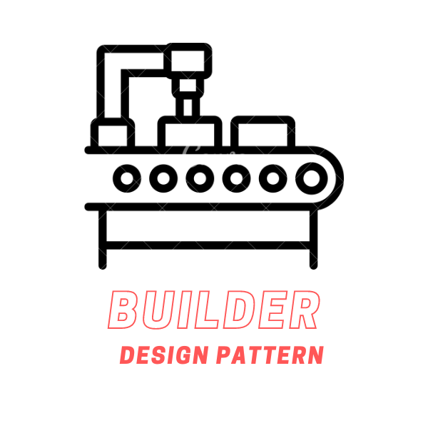
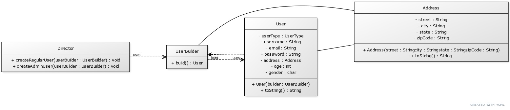

# Builder Design Pattern

The Builder design pattern is a creational pattern that separates the construction of a complex object from its representation, allowing the same construction process to create different representations. This pattern is useful when the construction process is complex and involves multiple steps, or when the object creation logic needs to be isolated from the object's main class.

    </img>

## ☹️ Problem

Consider a scenario where you're developing a user registration system for a website. The User object in this system has many fields, some of which are required (like username and password), while others are optional (like email, phone, address, age, gender, etc.). Creating a User object involves multiple steps and the order of steps doesn't matter. Also, the variety of User objects that can be created is vast, depending on the combination of fields chosen. If we were to create a User class with a constructor that accepts all possible fields, it would become messy and hard to manage, especially when some fields are optional. Also, it would be difficult to control the order in which the fields are set.

## 😀 Solution

The Builder Design Pattern can provide a solution to this problem. We can create a `UserBuilder` class that provides a step-by-step way to define a `User`. This class would have methods like `setUsername()`, `setPassword()`, `setEmail()`, `setPhone()`, `setAddress()`, `setAge()`, `setGender()`, etc. The `User` class would then have a constructor that accepts a `UserBuilder` object. The `UserBuilder` object would be used to construct the `User` object. This way, the construction of a User is separated from its representation, and the same construction process can create different representations of a User. This makes the code more flexible and easier to read and maintain. It also allows for the creation of complex User objects in a controlled, step-by-step manner. You can find the implementation of this example in the [code snippet](./src). Below is the UML class diagram of the Builder design pattern.

    </img>

## 💡 Applicability

The Builder Design Pattern is applicable in the following situations:

- When the construction of an object involves multiple steps that need to be executed in a specific order.
- When the construction process needs to create different representations of the same object.
- When the construction process needs to be isolated from the main class of the object being constructed.
- When the construction process needs to be flexible and allow for variations in the final object.

## 📝 How to Implement

To implement the Builder Design Pattern, we can follow these steps:

1. Define the product class that represents the complex object to be created.
2. Create a builder class that provides a step-by-step way to construct the product object.
3. Define methods in the builder class to set the different parts of the product object.
4. Create a director class that uses the builder class to construct the product object.
5. Use the director class to construct the product object by calling the builder methods in the desired order.
6. Return the final product object from the director class.

## ⚖️ Pros and Cons

### Pros

- Allows for the construction of complex objects in a step-by-step manner.
- Separates the construction of an object from its representation.
- Allows for the creation of different representations of the same object.
- Provides a flexible and controlled way to construct objects.

### Cons

- Can lead to the creation of many classes if the object being constructed has many parts.
- Requires the client to know the steps involved in constructing the object.
- Can be complex to implement if the object has many optional parts.
- Can lead to code duplication if the same construction logic is repeated in multiple builders.
