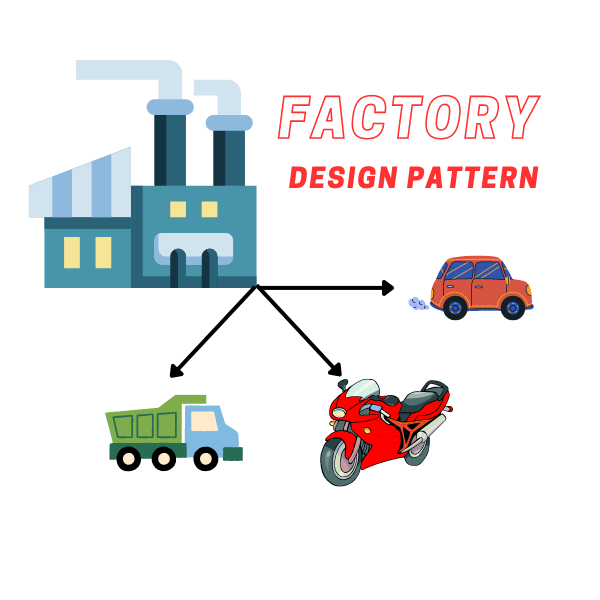
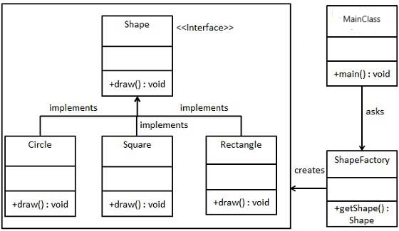

# Factory Method Design Pattern

The Factory Method design pattern is a creational pattern that provides an interface for creating objects in a superclass, but allows subclasses to alter the type of objects that will be created. This pattern is useful when a class cannot anticipate the type of objects it needs to create, or when a class wants its subclasses to decide which objects to create.

    </img>

## ☹️ Problem

In a graphics application, we often need to create various types of shapes like squares, rectangles, circles, etc. However, the process of creating these shapes can be complex and may vary depending on the type of shape. Moreover, the client code that needs these shapes shouldn't be burdened with the details of how these shapes are created or the specifics of what makes a square a square or a rectangle a rectangle. This can lead to code that is hard to manage and extend, especially as more shape types are added to the application.

## 😀 Solution

The Factory Method design pattern can provide a solution to this problem. We can create an interface or abstract class that defines a factory method for creating objects. Concrete classes can then implement this interface or extend the abstract class to provide specific implementations of the factory method. This way, the client code can create objects without knowing their exact classes, and the responsibility of object creation is delegated to the subclasses. This promotes loose coupling between the creator and product classes and allows for easy extensibility by adding new product classes and corresponding creator classes. You can find the implementation of this example in the [code snippet](./src). Below is the UML class diagram of the Factory Method design pattern.

    </img>

## 💡 Applicability

The Factory Method design pattern is applicable in the following scenarios:

- When a class cannot anticipate the type of objects it needs to create.
- When a class wants its subclasses to decide which objects to create.
- When a class wants to delegate the responsibility of object creation to its subclasses.

## 📝 How to Implement

To implement the Factory Method design pattern, follow these steps:

1. Define an interface or abstract class that declares the factory method for creating objects.
2. Create concrete classes that implement the interface or extend the abstract class.
3. Define factory methods in the concrete classes to create instances of specific types of objects.
4. Use the factory methods to create objects without specifying their exact classes.
5. Clients can use the factory methods to create objects based on their requirements.

## ⚖️ Pros and Cons

### Pros

- Provides a flexible way to create objects without specifying their exact classes.
- Allows for easy extensibility by adding new product classes and corresponding creator classes.
- Promotes loose coupling between the creator and product classes.

### Cons

- Can result in a large number of creator classes if there are many different product types.
- May introduce complexity if the factory method logic becomes too complex.
- Requires careful design to ensure that the creator and product classes are properly structured and cohesive.
