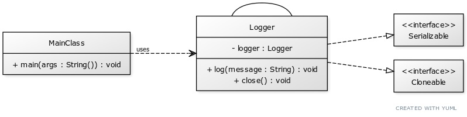

# Singleton Design Pattern

The Singleton pattern is a part of the Creational Design Patterns. This pattern restricts the instantiation of a class and ensures that only one instance of the class exists in the Java Virtual Machine. The singleton class must provide a global access point to get the instance of the class.

<p align="center">
    </img>
</p>

## ☹️ Problem

Consider a scenario where you're developing a logging system for a large application. The logging system needs to write logs to a file, and it's important that all parts of the application write to the same log file. If multiple instances of the logging class are created, they might conflict with each other when trying to write to the log file, leading to potential issues like lost logs or corrupted log files. Moreover, creating multiple instances of the logging class could be resource-intensive, especially if the logging class has heavy initialization code (like opening a file handle or setting up a network connection).

## 😀 Solution

The Singleton Design Pattern can provide a solution to this problem. We can create a Logger class that is a singleton, ensuring that only one instance of the Logger class exists in the application. This singleton Logger class would provide a global access point for logging, and all parts of the application would use this single Logger instance to write logs. This way, we can ensure that all logs are written to the same file in a coordinated manner, and we can avoid the resource overhead of creating multiple Logger instances. You can find the implementation of this example in the [code snippet](./src). Below is the UML diagram of the Singleton design pattern.

<p align="center">
    </img>
</p>

## 💡 Applicability

The Singleton Design Pattern is applicable in the following situations:

- When you need to ensure that only one instance of a class exists in the Java Virtual Machine.
- When you need a global access point to that instance.
- When you need to control the instantiation of a class, ensuring that no other instance can be created.
- When you need to restrict the number of instances of a class to one or a fixed number.
- When you need to manage a shared resource, such as a database connection or a file system.
- When you need to cache objects in memory for reuse.

## 📝 How to Implement

To implement the Singleton Design Pattern, we can follow these steps:

1. Create a private static instance of the class that is the singleton.
2. Create a private constructor for the class to prevent external instantiation.
3. Provide a public static method to get the singleton instance of the class.
4. Optionally, provide lazy initialization of the singleton instance to defer its creation until it is needed.
5. Optionally, provide thread-safe initialization of the singleton instance to ensure that it is created only once in a multi-threaded environment.
6. Use the singleton instance to perform the desired operations.

## ⚖️ Pros and Cons

### Pros

- Ensures that only one instance of a class exists in the Java Virtual Machine.
- Provides a global access point to that instance.
- Allows for lazy initialization of the singleton instance.
- Allows for thread-safe initialization of the singleton instance.
- Can be used to manage shared resources efficiently.

### Cons

- Can make the code harder to test, as singletons introduce global state.
- Can lead to tight coupling between classes that use the singleton.
- Can make the code less flexible, as singletons are difficult to replace or extend.
- Can make the code less scalable, as singletons can become bottlenecks in multi-threaded environments.
- Can make the code harder to understand, as singletons hide dependencies and create hidden coupling.
  
## Breaking Singleton Pattern

The Singleton Design Pattern can be broken in several ways. Some of the common ways to break the Singleton pattern are:

1. **Reflection**: By using reflection, it is possible to access the private constructor of a singleton class and create multiple instances of the class. To prevent this, you can throw an exception in the private constructor if an instance already exists.

    ```java
    //problematic code
    Constructor<Singleton> constructor = Singleton.class.getDeclaredConstructor();
    constructor.setAccessible(true);
    Singleton instance1 = constructor.newInstance();
    Singleton instance2 = constructor.newInstance();

    //solution
    if (instance != null) {
            throw new IllegalStateException("Singleton instance already exists");
    }
    ```

2. **Serialization**: When a singleton class is serialized and then deserialized, it creates a new instance of the class. To prevent

   ```java
    //problematic code
    ObjectOutputStream oos = new ObjectOutputStream(new FileOutputStream("singleton.ob"));
    oos.writeObject(Singleton.getInstance());
    ObjectInputStream ois = new ObjectInputStream(new FileInputStream("singleton.ob"));
    Singleton instance = (Singleton) ois.readObject();
    
    //solution
    private Object readResolve() {
        return instance;
    }
    ```

3. **Cloning**: By overriding the `clone()` method in a singleton class, it is possible to create a new instance of the class. To prevent this, you can throw an exception in the `clone()` method.

    ```java
    //problematic code
    Singleton instance1 = Singleton.getInstance();
    Singleton instance2 = (Singleton) instance1.clone();

    //solution
    @Override
    protected Object clone() throws CloneNotSupportedException {
        throw new CloneNotSupportedException("Singleton instance cannot be cloned");
    }
    ```

4. **Multiple Classloaders**: If a singleton class is loaded by multiple classloaders, it can create multiple instances of the class. To prevent this, you can use a static block to initialize the singleton instance.

    ```java
    //problematic code
    ClassLoader classLoader1 = new CustomClassLoader();
    ClassLoader classLoader2 = new CustomClassLoader();
    Class<?> clazz1 = classLoader1.loadClass("Singleton");
    Class<?> clazz2 = classLoader2.loadClass("Singleton");
    Singleton instance1 = (Singleton) clazz1.newInstance();
    Singleton instance2 = (Singleton) clazz2.newInstance();

    //solution
    private static final Singleton instance = new Singleton();
    ```
