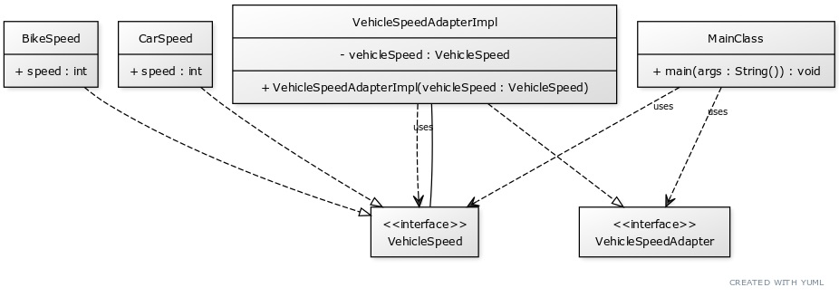

# Adapter Design Pattern

The Adapter Design Pattern is a structural design pattern that allows objects with incompatible interfaces to collaborate. It's often used when you want to make your existing classes work with others without modifying their source code. The Adapter pattern provides a way to use a class with a different interface than the one it was designed to use.

    </img>

## ☹️ Problem

Suppose you have a app that show car speed and you have a data source class that provides the car speed. The data source class has a method `getSpeed()` that returns the car speed in km/h. However, the app expects the car speed in m/s. You can't change the data source class because it's used by other apps that expect the speed in km/h. How can you make the data source class work with your app without modifying its source code?

## 😀 Solution

The Adapter Design Pattern solves this problem by creating an adapter class that wraps the data source class and provides the expected interface. The adapter class implements the interface expected by the app and internally uses the data source class to get the car speed in km/h. The adapter class then converts the speed from km/h to m/s and returns it to the app. The app can now use the adapter class to get the car speed in m/s without modifying the data source class. In the context of our car speed app:

1. **Target (`SpeedAdapter`)**: This is an interface that represents the expected interface that the app uses to get the car speed in m/s. It declares a method `getSpeed()` that returns the car speed in m/s.
2. **Adapter (`CarSpeedAdapter`)**: This is a class that implements the `SpeedAdapter` interface and wraps the data source class. It has a reference to the data source class and implements the `getSpeed()` method by calling the `getSpeed()` method of the data source class and converting the speed from km/h to m/s.
3. **Adaptee (`CarSpeedDataSource`)**: This is a class that provides the car speed in km/h. It has a method `getSpeed()` that returns the car speed in km/h.
4. **Client (`CarSpeedApp`)**: This class uses the `SpeedAdapter` interface to get the car speed in m/s. It creates an instance of the adapter class and uses it to get the car speed in m/s.

This way, you can make the data source class work with your app without modifying its source code. You can create an adapter class that wraps the data source class and provides the expected interface. The app can use the adapter class to get the car speed in m/s. You can find the implementation of this example in the [code snippet](./src). Below is the UML class diagram of the Adapter design pattern.

    </img>

## 💡 Applicability

Use the Adapter pattern when:

1. You want to use some existing class, but its interface isn't compatible with the rest of your code.
2. You want to create a reusable class that cooperates with unrelated or unforeseen classes, that is, classes that don't necessarily have compatible interfaces.
3. You need to use several existing subclasses, but it's impractical to adapt their interface by subclassing every one. An adapter can adapt the interface of its parent class.

## 📝 How to Implement

To implement the Adapter Design Pattern, you can follow these steps:

1. Identify the incompatible interfaces that need to work together.
2. Create an adapter class that implements the interface expected by the client code.
3. In the adapter class, create an instance of the class with the incompatible interface.
4. Implement the methods of the adapter class by calling the methods of the class with the incompatible interface.
5. Use the adapter class in the client code to work with the class with the incompatible interface.
6. Optionally, you can create multiple adapters for different classes with incompatible interfaces.
7. Optionally, you can create a two-way adapter that can work with both classes.
8. Optionally, you can create a class adapter that extends the class with the incompatible interface.

## ⚖️ Pros and Cons

### Pros

- Allows objects with incompatible interfaces to collaborate.
- Can be used to make existing classes work with others without modifying their source code.
- Provides a way to use a class with a different interface than the one it was designed to use.
- Can be used to create a reusable class that cooperates with unrelated or unforeseen classes.

### Cons

- Can make the code more complex by introducing additional classes.
- Can make the code harder to understand by adding an extra layer of abstraction.
- Can make the code harder to test by introducing dependencies on external classes.
- Can make the code harder to maintain by creating additional points of failure.
