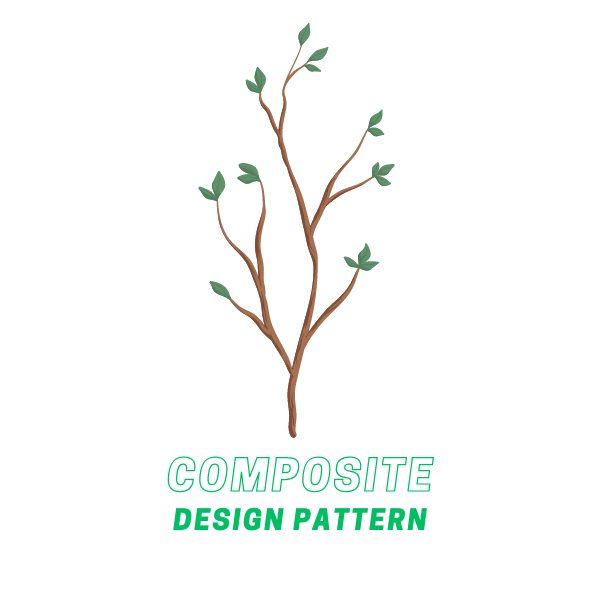
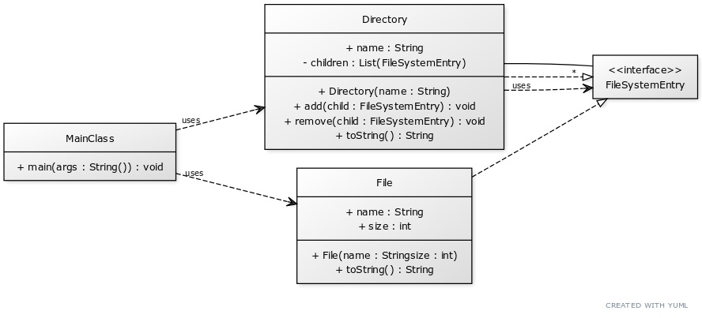

# Composite Design Pattern

The Composite Design Pattern is a structural design pattern that allows you to compose objects into tree structures and then work with these structures as if they were individual objects. It's often used when you want to represent part-whole hierarchies of objects.

    </img>

## ☹️ Problem

Imagine you're developing a file system utility tool that needs to treat files and directories uniformly. In a file system, a directory entry could be a simple file or a directory that contains other files or directories. You want to be able to perform operations like calculating the total storage used, counting the number of files, or searching for a file in the system. These operations should work uniformly, whether they are performed on a simple file or a complex directory. How can you achieve this without having separate code logic for files and directories?

## 😀 Solution

The Composite Design Pattern provides an elegant solution to this problem. In this pattern, both the individual objects (files) and their containers (directories) implement the same interface which declares the methods that are common to both.In the context of our file system:

1. **Component (`FileSystemEntry`)**: This is a base class that defines the common interface for the simplest objects (File) and complex containers (Directory). It would declare methods like `getSize()`, `getName()`, `search(file)`, etc.

2. **Leaf (`File`)**: This class represents the leaf objects in the composition. It implements all `FileSystemEntry` operations.

3. **Composite (`Directory`)**: This class represents complex objects (directories). It implements all `FileSystemEntry` operations and stores child `FileSystemEntry` components. It implements the operations in such a way that they can be applied recursively to every component in the directory.

This way, you can treat files and directories uniformly. For example, to calculate the total storage used, you can simply call the `getSize()` method on the root directory, and it will recursively calculate the size of all files in all directories. You can find the implementation of this example in the [code snippet](./src). Below is the UML class diagram of the Composite design pattern.

    </img>

## 💡 Applicability

Use the Composite pattern when:

1. You want to represent part-whole hierarchies of objects.
2. You want clients to be able to ignore the difference between compositions of objects and individual objects.
3. You want to treat both simple and complex objects uniformly.

## 📝 How to Implement

To implement the Composite Design Pattern, you can follow these steps:

1. Define a base class (`Component`) that declares the common interface for both simple and complex objects.
2. Define leaf classes (`Leaf`) that represent the simple objects in the composition. They implement the operations declared in the `Component` class.
3. Define composite classes (`Composite`) that represent the complex objects in the composition. They implement the operations declared in the `Component` class and store child components.
4. In the composite class, implement the operations in such a way that they can be applied recursively to every component in the composition.
5. Use the composite class to create object hierarchies and work with them uniformly.

## ⚖️ Pros and Cons

### Pros

- Allows you to compose objects into tree structures and work with these structures uniformly.
- Allows you to represent part-whole hierarchies of objects.
- Allows clients to ignore the difference between compositions of objects and individual objects.
- Simplifies the client code by treating both simple and complex objects uniformly.

### Cons

- Can make the code more complex by introducing additional classes.
- Can make the code harder to understand by adding an extra layer of abstraction.
- Can make the code harder to test by introducing dependencies on external classes.
- Can make the code harder to maintain by creating additional points of failure.
