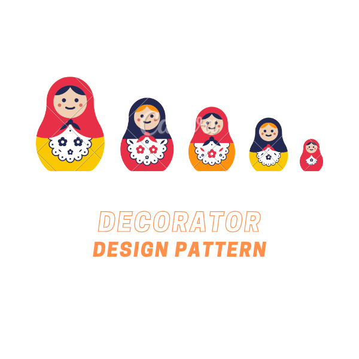
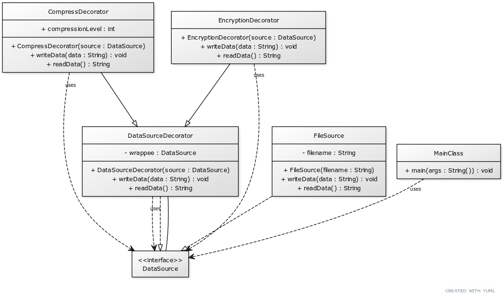

# Decorator Design Pattern

The Decorator Design Pattern is a structural design pattern that allows you to add new behaviors to objects dynamically by placing these objects inside special wrapper objects. Using decorators, you can stack behaviors dynamically at runtime.

    </img>

## ☹️ Problem

Imagine you are reading and writing data to a file. You have a `File` class that provides basic functionality to read and write data to a file. Now, you want to add encryption and compression functionality to the file. You can add these functionalities to the `File` class, but this will make the class more complex and less maintainable. Also, if you want to add more functionalities in the future, you will have to modify the `File` class again. This violates the Open-Closed Principle. How can you add these functionalities to the `File` class without modifying it?

## 😀 Solution

The solution is to use the Decorator Design Pattern. The Decorator Design Pattern allows you to add new behaviors to objects dynamically by placing these objects inside special wrapper objects. Using decorators, you can stack behaviors dynamically at runtime. In the context of our file system:

1. **Component (`File`)**: This is a base class that defines the common interface for the concrete components and decorators. It would declare methods like `read()`, `write()`, etc.
2. **Concrete Component (`SimpleFile`)**: This class represents the concrete components that provide basic functionality. It implements all `File` operations.
3. **Decorator (`FileDecorator`)**: This is an abstract class that defines the common interface for all decorators. It has a reference to the `File` component and implements the same interface as the `File` component.
4. **Concrete Decorators (`EncryptionDecorator`, `CompressionDecorator`)**: These classes represent the concrete decorators that add new behaviors to the components. They implement the same interface as the `File` component and add new functionalities to the component.
5. **Client (`Client`)**: This class creates the concrete components and decorators and stacks them together to add new behaviors to the components.

This way, you can add new behaviors to objects dynamically without modifying the objects themselves. For example, you can create a `SimpleFile` object and then wrap it with an `EncryptionDecorator` and a `CompressionDecorator` to add encryption and compression functionalities to the file. You can find the implementation of this example in the [code snippet](./src). Below is the UML class diagram of the Decorator design pattern.

    </img>

## 💡 Applicability

Use the Decorator pattern when:

1. You want to add responsibilities to individual objects dynamically and transparently, without affecting other objects.
2. You want to add responsibilities to an object that you may want to change in future.
3. You want to extend an object's behavior without subclassing.
4. You want to add new functionalities to an object without modifying its structure.

## 📝 How to Implement

To implement the Decorator Design Pattern, you can follow these steps:

1. Define a base class (`Component`) that declares the common interface for both concrete components and decorators.
2. Define concrete classes (`ConcreteComponent`) that represent the concrete components that provide basic functionality. They implement the operations declared in the `Component` class.
3. Define an abstract class (`Decorator`) that defines the common interface for all decorators. It has a reference to the `Component` class and implements the same interface as the `Component` class.
4. Define concrete classes (`ConcreteDecorator`) that represent the concrete decorators that add new behaviors to the components. They implement the same interface as the `Component` class and add new functionalities to the component.
5. Use the concrete decorators to add new behaviors to the components.
6. You can stack multiple decorators on top of each other to add multiple behaviors to the components.

## ⚖️ Pros and Cons

### Pros

- Allows you to add responsibilities to individual objects dynamically and transparently, without affecting other objects.
- Allows you to add responsibilities to an object that you may want to change in future.
- Allows you to extend an object's behavior without subclassing.
- Allows you to add new functionalities to an object without modifying its structure.

### Cons

- Can make the code more complex by introducing additional classes.
- Can make the code harder to understand by adding an extra layer of abstraction.
- Can make the code harder to test by introducing dependencies on external classes.
- Can make the code harder to debug by introducing multiple layers of decorators.
