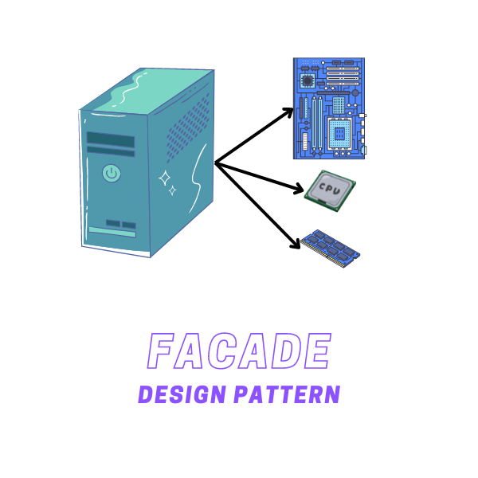
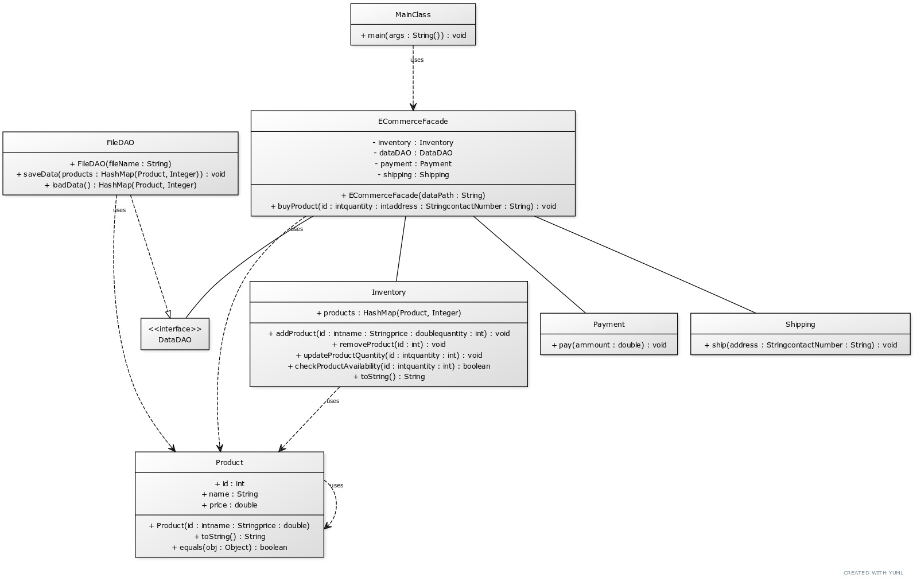

# Facade Design Pattern

The Facade Design Pattern is a structural design pattern that provides a simplified interface to a library, a framework, or any other complex set of classes. It hides the complexities of the larger system and provides a simpler interface to the client.

    </img>

## ☹️ Problem

Imagine you're developing an e-commerce platform. The platform needs to handle a variety of complex operations such as inventory management, payment processing, shipping, and more. Each of these operations involves interacting with different subsystems, each with its own set of interfaces. Integrating all these subsystems into your application can make the code complicated and hard to understand. How can you simplify the interaction with these subsystems?

## 😀 Solution

The Facade Design Pattern provides an elegant solution to this problem. You can create a facade class that provides a simple interface for handling e-commerce operations. This facade class encapsulates the complexities of the subsystems (inventory, payment, shipping, etc.) and provides simple methods to interact with them. In the context of our e-commerce platform:

1. **Facade (`ECommerceFacade`)**: This is a class that provides a simple interface to the complex subsystems. It encapsulates the interactions with the subsystems and provides simple methods to the client.
2. **Subsystem Classes (`Inventory`, `Payment`, `Shipping`)**: These are the complex subsystems that the facade interacts with. They have their own interfaces and implementations.
3. **Client (`Client`)**: This class uses the facade class to interact with the subsystems. It doesn't need to know the details of the subsystems and can use the simple methods provided by the facade.

This way, you can simplify the interaction with complex subsystems by providing a simple interface to the client. For example, you can create an `ECommerceFacade` object and use its `purchaseProduct()` method to handle the entire purchase process, including inventory management, payment processing, and shipping. You can find the implementation of this example in the [code snippet](./src). Below is the UML class diagram of the Facade design pattern.

    </img>

## 💡 Applicability

Use the Facade pattern when:

1. You want to provide a simple interface to a complex subsystem.
2. You want to decouple the client code from the complex subsystems.
3. You want to reduce dependencies between the client code and the subsystems.
4. You want to organize a subsystem into layers.

## 📝 How to Implement

To implement the Facade Design Pattern, you can follow these steps:

1. Identify a complex subsystem that you want to simplify for the client.
2. Create a facade class that provides a simple interface to the complex subsystem.
3. The facade class should encapsulate the interactions with the subsystem and provide simple methods to the client.
4. The client code should use the facade class to interact with the subsystem. It should not need to know the details of the subsystem.
5. You can add additional methods to the facade class to provide more functionality to the client.
6. You can use the facade class to organize the subsystem into layers and provide a simple interface to each layer.

## ⚖️ Pros and Cons

### Pros

- Provides a simple interface to a complex subsystem.
- Decouples the client code from the complex subsystems.
- Reduces dependencies between the client code and the subsystems.
- Organizes a subsystem into layers.

### Cons

- Can make the code harder to test by introducing dependencies on external classes.
- Can hide the complexity of the subsystem, making it harder to understand the system as a whole.
- Can make the code harder to maintain by introducing an additional layer of abstraction.
- Can make the code harder to extend by limiting access to the subsystem's functionality.
