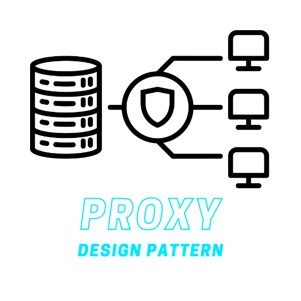
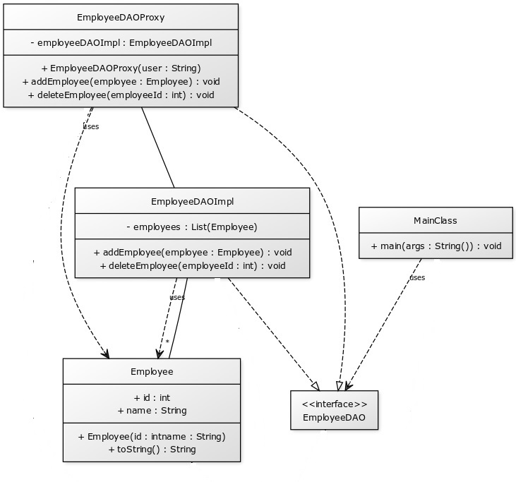

# Proxy Design Pattern

The Proxy Design Pattern is a structural design pattern that provides a surrogate or placeholder for another object to control access to it. It involves a class, called the proxy, which represents functionality of another class.

    </img>

## ☹️ Problem

Imagine you have a class that read the data from the database and modifies it. But you want to restrict the access to the database for some users. You can't just give the access to the database to everyone. You need to restrict the access to the database for some users. How would you do that?

## 😀 Solution

The Proxy Design Pattern provides a surrogate or placeholder for another object to control access to it. It involves a class, called the proxy, which represents functionality of another class. The proxy class has the same interface as the real object, so the client can use it in the same way as the real object. The proxy class controls access to the real object, so the client can't access the real object directly. In the context of our database example:

1. **Subject (`EmployeeDAO`)**: This is an interface that defines the functionality of the real object and the proxy object. It has methods to read and modify the data in the database.
2. **Real Subject (`EmployeeDAOImpl`)**: This is a class that implements the `EmployeeDAO` interface. It reads the data from the database and modifies it.
3. **Proxy (`EmployeeDAOProxy`)**: This is a class that implements the `EmployeeDAO` interface. It has a reference to the real object and controls access to it. It checks the user's permissions before allowing access to the real object.
4. **Client (`MainClass`)**: This class uses the proxy class to access the real object. It can't access the real object directly, so it uses the proxy class to read and modify the data in the database.

This way, you can restrict access to the real object by using a proxy class. The proxy class checks the user's permissions before allowing access to the real object. For example, you can create an `EmployeeProxy` object and use its `getData()` method to read the data from the database. You can find the implementation of this example in the [code snippet](./src). Below is the UML class diagram of the Proxy design pattern.

    </img>

## 💡 Applicability

Use the Proxy pattern when:

1. You want to control access to an object.
2. You want to add additional functionality to an object without changing its interface.
3. You want to defer the creation and initialization of an object until it is actually needed.
4. You want to cache the results of an expensive operation.
5. You want to log requests to an object.

## 📝 How to Implement

To implement the Proxy Design Pattern, you can follow these steps:

1. Identify an object that you want to control access to.
2. Create an interface that defines the functionality of the real object and the proxy object.
3. Create a class that implements the interface and represents the real object.
4. Create a class that implements the interface and represents the proxy object.
5. The proxy class should have a reference to the real object and control access to it.
6. The client code should use the proxy class to access the real object. It should not access the real object directly.

## ⚖️ Pros and Cons

### Pros

- Controls access to an object.
- Adds additional functionality to an object without changing its interface.
- Defers the creation and initialization of an object until it is actually needed.
- Caches the results of an expensive operation.
- Logs requests to an object.

### Cons

- Can make the code harder to test by introducing dependencies on external classes.
- Can hide the complexity of the real object, making it harder to understand the system as a whole.
- Can make the code harder to maintain by introducing an additional layer of abstraction.
